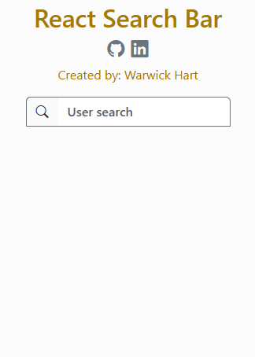

# 1. React Search Bar

React Search bar created by Warwick Hart aka [BobWritesCode](https://github.com/BobWritesCode) available to be used by anyone. I would appreciate it if you did use this search bar to either leave me a star and/or provide credit linking to [my GitHub profile](https://github.com/BobWritesCode). Thank you.



## 1.1. Contents

- [1. React Search Bar](#1-react-search-bar)
  - [1.1. Contents](#11-contents)
  - [1.2. Requirements](#12-requirements)
    - [1.2.1. Bootstrap](#121-bootstrap)
    - [1.2.2. React Bootstrap](#122-react-bootstrap)
    - [1.2.3. Bootstrap icons](#123-bootstrap-icons)
  - [1.3. Components](#13-components)
    - [1.3.1. SearchBar.js](#131-searchbarjs)
    - [1.3.2. Spinner.js](#132-spinnerjs)

---

## 1.2. Requirements

[🔝](#11-contents)

---

### 1.2.1. Bootstrap

Some of the styling uses Bootstrap. So you can either remove the Bootstrap classes if are not using Bootstrap or make sure to add Bootstrap to your project.

You can add the following CDN to your `index.html` within the `<head>` tags.

```html
<!-- Boostrap stylesheet -->
<link rel="stylesheet" href="https://cdn.jsdelivr.net/npm/bootstrap@5.2.3/dist/css/bootstrap.min.css"
  integrity="sha384-rbsA2VBKQhggwzxH7pPCaAqO46MgnOM80zW1RWuH61DGLwZJEdK2Kadq2F9CUG65" crossorigin="anonymous" />
```

This version of the search bar is currently using `Bootstrap v5.2.3`. If you plan to use a different version you may be required to change some of the classes.

[🔝](#11-contents)

---

### 1.2.2. React Bootstrap

See the official [React Bootstrap website](https://react-bootstrap.github.io/docs/getting-started/introduction) to find instructions to install.

This version of the search bar is currently using `React Bootstrap v2.7.4`. If you plan to use a different version you may be required to change some of the classes.

[🔝](#11-contents)

---

### 1.2.3. Bootstrap icons

I use one icon from Bootstrap icons. If you do not plan to use this icon, then you do not need to use this package.

Add the following to your `index.html` within the `<head>` tags

``` html
<!-- Boostrap Icons -->
<link rel="stylesheet" href="https://cdn.jsdelivr.net/npm/bootstrap-icons@1.10.5/font/bootstrap-icons.css">
 ```

This version of the search bar is currently using `Bootstrap icons v1.10.5`. If you plan to use a different version you may be required to change some of the classes.

[🔝](#11-contents)

---

## 1.3. Components

There are two components you will need from this project: [SearchBar.js](https://github.com/BobWritesCode/react-search-bar/blob/master/src/components/utils/SearchBar.js) and [Spinner.js](https://github.com/BobWritesCode/react-search-bar/blob/master/src/components/utils/Spinner.js).

[🔝](#11-contents)

---

### 1.3.1. SearchBar.js

[SearchBar.js](https://github.com/BobWritesCode/react-search-bar/blob/master/src/components/utils/SearchBar.js)

Within this file there are two things you will need to adjust: Your API/Data request, and what you want to happen once a result has been select.

Firstly, where to put your API/Data request.

``` js
/**
 * Fetches data based on text input from end user.
 */
useEffect(() => {
  // Check if any text in search input.
  if (content) {
    // Show spinner while API/data request resolves.
    setShowSpinner(true);
    const fetchData = async () => {
      try {
        // Mock API/data request START. -----------------
        // Input your API/data request here.
        const data = MockSearch({ query: content });
        // Mock API/data request END. -----------------
        setResults(data);
      } catch (err) {
        /* empty */
      } finally {
        setShowSpinner(false);
      }
```

Secondly, put in the code for what you want to happen when a result is selected.

```js
/**
 * Handles user clicking on one of the results.
 * @param {*} result
 */
const handleSearchResultClick = (result) => {
  // Put your code here with what you want to happen when the result is selected.
  setContent('');
  setResults({});
  setShowSpinner(false);
};
```

[🔝](#11-contents)

---

### 1.3.2. Spinner.js

[Spinner.js](https://github.com/BobWritesCode/react-search-bar/blob/master/src/components/utils/Spinner.js)

Very simply this is the [React Bootstrap](#122-react-bootstrap) spinner that is shown before data is returned from the Data/API request.

[🔝](#11-contents)

---
